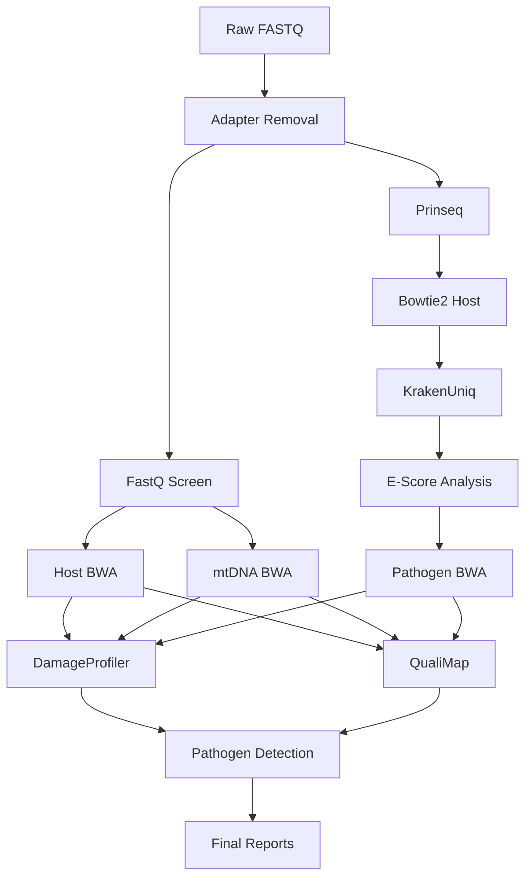

# 🐖 PIGSTI                                                                                                                                                                                                                                                                (Pathogen anImal Genome Sequence ToolkIt)

[](https://opensource.org/licenses/MIT)
[](https://snakemake.github.io)
[](https://www.python.org)
[](https://conda.io)

A comprehensive bioinformatics pipeline for pathogen identification, genomic surveillance, and ancient DNA analysis using metagenomic sequencing data.

## 🧬 Overview

PIGSTI is a state-of-the-art bioinformatics pipeline designed for:
- **Pathogen Detection**: Automated identification of ancient pathogens from metagenomic data
- **Host Genome Identification**: Comprehensive host identification and endogenous estimation 
- **Quality Control**: Extensive QC metrics and contamination screening


## 🚀 Quick Start

### Prerequisites

- **Snakemake** ≥ 7.0.0
- **Conda** or **Mamba**
- **Python** 3.9+
- **Linux/macOS** environment

### Installation

## 🔧 Installation                                                                                                                                                                                       [0/1810]
# 1️⃣ Install Miniconda (Linux)

If not already installed:

### Download Miniconda installer (Linux, Python 3)
```
wget https://repo.anaconda.com/miniconda/Miniconda3-latest-Linux-x86_64.sh
```
### Install Miniconda
```
bash Miniconda3-latest-Linux-x86_64.sh
```

### Follow prompts, then reload shell
```
source ~/.bashrc
```

# 2️⃣ Download PIGSTI and Install Snakemake

### Clone the repository
```
git clone https://github.com/LouisLhote/PIGSTI.git
cd PIGSTI
```
### Create the conda environment from the provided YAML
```
conda env create -n pigsti-snake -f PIGSTI_snakemake.yaml
```

### Activate the environment
```
conda activate pigsti-snake
```
---

# ▶️ Running the Pipeline

Once the environment is active, run the workflow with:
```
snakemake --cores <N> --use-conda
```
Replace `<N>` with the number of CPU cores you want to use.

---


## 📁 Project Structure

```
PIGSTI/
├── config/                          # Configuration files
│   ├── config.yaml                  # Main pipeline configuration
│   ├── samples.tsv                  # Sample information
│   ├── Pathogen_spreadsheet.csv     # Pathogen reference database
│   └── config_hops2.0.txt          # HOPS configuration
├── scripts/                         # Pipeline scripts
│   ├── generate_pipeline_report.py  # Monitoring and reporting
│   ├── calculate_detection_scores.py # Pathogen scoring
│   └── ...                         # Other analysis scripts
├── workflow/
│   └── envs/                       # Conda environment definitions
├── results/                         # Pipeline outputs
│   ├── pipeline_execution_report.html # Interactive monitoring report
│   ├── pipeline_workflow_diagram.png # Workflow visualization
│   └── ...                         # Analysis results
├── logs/                           # Execution logs
└── Snakefile                       # Main pipeline definition
```

## 📋 Configuration

### Sample Configuration (`config/samples.tsv`)

```tsv
sample	r1	r2	RGLB	sequencing_run
Sample1	/path/to/Sample1_R1.fastq.gz	/path/to/Sample1_R2.fastq.gz	Sample1-LIB	Run1
Sample2	/path/to/Sample2_R1.fastq.gz		Sample2-LIB	Run2
```

**Note**: Leave `r2` empty for single-end samples.

### Main Configuration (`config/config.yaml`)

```yaml
# Database paths
kraken_db: "/path/to/krakenuniq/database"
host_index: "/path/to/host/bwa/index"

# BWA indices for different species
bwa_indices:
  "Homo sapiens": "/path/to/human/index"
  "Sus scrofa": "/path/to/pig/index"

mtDNA_indices:
  "Homo sapiens": "/path/to/human/mtdna/index"
  "Sus scrofa": "/path/to/pig/mtdna/index"

# Analysis parameters
min_read_length: 30
quality_threshold: 30
```

## 🔄 Pipeline Workflow



## 📊 Output Files

### Core Analysis Results
- **Pathogen Detection**: `results/{sample}/Escore/pathogen/{sample}_pathogen.csv`
- **Host Alignment**: `results/{sample}/bwa_host/{sample}.dedup.bam`
- **mtDNA Alignment**: `results/{sample}/bwa_mtdna/{sample}.dedup.bam`
- **Pathogen Alignments**: `results/{sample}/bwa_pathogen/{sample}_{pathogen}.dedup.bam`

### Quality Control Reports
- **FastQ Screen**: `results/{sample}/fastq_screen/{sample}.collapsed_screen.html`
- **QualiMap**: `results/{sample}/qualimap/genome_results.txt`
- **DamageProfiler**: `results/{sample}/damageprofiler_host/`

### Monitoring & Visualization
- **Pipeline Report**: `results/pipeline_execution_report.html`
- **Workflow Diagram**: `results/pipeline_workflow_diagram.png`
- **Timing Data**: `results/pipeline_timing_data.csv`
- **Detection Scores**: `results/pathogen_detection/detection_scores_matrix.csv`

## 🎛️ Advanced Usage

### Running Specific Steps

```bash
# Run only adapter removal
snakemake --cores 8 results/*/adapter_removal/*.collapsed.gz

# Run only pathogen detection
snakemake --cores 16 results/*/Escore/pathogen/*.csv

# Generate monitoring report
snakemake --cores 4 results/pipeline_execution_report.html
```

### Custom Configuration

```bash
# Use custom config file
snakemake --cores 40 --configfile custom_config.yaml

# Override specific parameters
snakemake --cores 40 --config min_read_length=50 quality_threshold=20
```

### Parallel Execution

```bash
# Run with cluster support
snakemake --cores 40 --cluster "sbatch --cpus-per-task={threads} --mem={resources.mem_mb}"

# Dry run to check workflow
snakemake --cores 40 --dry-run
```


### Performance Optimization

- **Memory**: Use `--resources mem_mb=32000` for memory-intensive steps
- **Storage**: Ensure sufficient disk space (recommend 100GB+ per sample)
- **Cores**: Optimal performance with 20-40 cores depending on sample size


## 📄 License

This project is licensed under the MIT License - see the [LICENSE](LICENSE) file for details.


---

**Made with ❤️ for the bioinformatics community**
