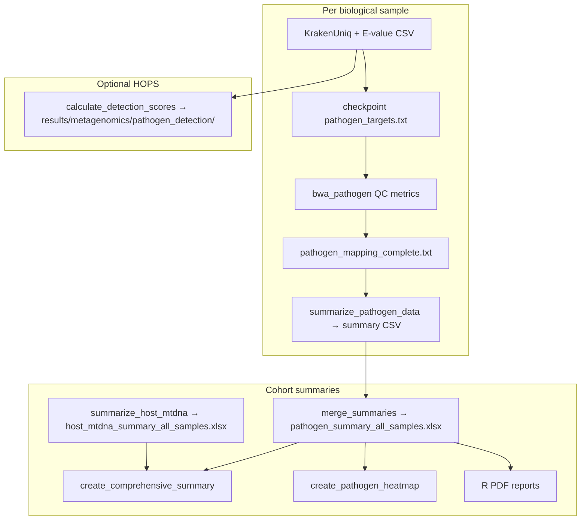

# Outputs & summaries diagnostic (pass 3)

**Date:** 2026-05-21  
**Scope:** `PIGSTI_publication/` — Snakemake summary rules, `results/final/*`, Excel/CSV contracts, R PDFs.  
**Companion:** [`OUTPUT_SCHEMA.md`](OUTPUT_SCHEMA.md), [`SNAKEMAKE_AUDIT_PASS2.md`](SNAKEMAKE_AUDIT_PASS2.md)

---

## Executive summary

| Area | Grade | Notes |
|------|-------|-------|
| Per-sample QC → CSV chain | **A-** | Barrier `pathogen_mapping_complete.txt` + checkpoint-aligned inputs |
| Merged Excel / dashboards | **B+** | Sheet name + column drift **fixed** in this pass |
| PCR-level summaries (`super_careful`) | **B** | Rule was **broken** (dual wildcards); **fixed** |
| Naming ↔ DAG alignment | **B+** | `refs_for_sample()` now uses `safe_name()`; some dead helpers remain |
| “Official” detection score | **C+** (docs) | Two scoring systems when HOPS is on — must be described in methods |

**Bottom line:** The scientific outputs are wired end-to-end; publication risk is mainly **documentation of which table/score to cite**, not missing files.

---

## End-to-end flow

### `rule all` deliverables (summary-related)

| Output | Producer | Consumer |
|--------|----------|----------|
| `results/{bio}/summary/{bio}_pathogen_summary.csv` | `summarize_pathogen_data` | merge, per-pathogen PDF, sample report |
| `results/final/pathogen_summary_all_samples.xlsx` | `merge_pathogen_summaries` | heatmap, comprehensive summary, multi-QC dashboard |
| `results/final/host_mtdna_summary_all_samples.xlsx` | `summarize_host_mtdna` | comprehensive summary, sample report |
| `results/final/comprehensive_summary_all_samples.xlsx` | `create_comprehensive_summary` | publication tables |
| `results/metagenomics/pathogen_detection/*` | `calculate_detection_scores` (HOPS only) | heatmap PDF/matrix — **not** the Excel `Score` column |
| `results/final/pathogen_summary_all_samples_pcr.xlsx` | `merge_pathogen_summaries_pcr` | only if `pathogen_mapping_mode: super_careful` |

---

## Per-artifact contracts

### 1. `{bio}_pathogen_summary.csv` (`scripts/summarize_pathogen_data.py`)

- **One row per** (bio sample × pathogen) from E-score taxonomy (+ optional HOPS union).
- **Key columns:** `Sample`, `Pathogen`, `Score` (`"passed/max"`), `Criteria_passed`, `ANI`, `Breadth_ratio`, `Relative_entropy` (1000 bp), `Relative_entropy_100bp`, `Relative_entropy_1000bp`, `Edit_distance_logR2`, `Edit_distance_decay_quality`, `Damage_5p_CtoT`, `Detected_by_Krakenuniq`, `Detected_by_HOPS`.
- **BAM source:** `--bam_dir results/sample_pathogen_mapping` (merged dedup BAMs).
- **Entropy files:** script reads `{bio}_{safe}.entropy_100bp.txt` / `.entropy_1000bp.txt` (falls back to `.mean_entropy.txt`). Snakemake now lists these as rule inputs so summaries cannot run before entropy jobs finish.

### 2. `pathogen_summary_all_samples.xlsx` (`scripts/merge_summaries.py`)

- **Sheet:** `pathogen_summary` (was implicit `Sheet1`; downstream readers updated).
- **Rows:** concatenation of all per-bio CSVs (empty/header-only files skipped).

### 3. `host_mtdna_summary_all_samples.xlsx` (`scripts/summarize_host_mtdna.py`)

- **Sheets:** `PCR_level`, `Sample_level`.
- **Sample key:** `bio_sample` on `Sample_level`; `create_comprehensive_summary.py` maps to `Sample` for merging.
- **Host columns used in merge:** `species`, `host_endogenous_pct`, `host_coverage`, `mtdna_coverage`, `host_q30_reads`, `duplication_rate`, etc. (not legacy `q30_reads` / `Species`).

### 4. `comprehensive_summary_all_samples.xlsx`

- **Sheets:** `All_Samples`, `Sample_Summary`, `Pathogen_Details`, `Host_mtDNA`.
- **Merge:** outer join on `Sample` (bio ID).
- **Column order:** aligned to current pathogen CSV headers (pass 3 fix).

### 5. HOPS detection matrix (`scripts/calculate_detection_scores.py`)

- **Separate** from per-row `Score` in the pathogen summary.
- Uses **9-point** checklist (E-score, HOPS×3, ANI, 5′/3′ damage, breadth, entropy).
- **HOPS species threshold:** `>1` in mapping/target code; scoring script may still use `>=2` for “detected” — state both in methods if both appear in figures.

---

## Issues found (pass 3)

### Fixed in `PIGSTI_publication/`

| ID | Issue | Fix |
|----|-------|-----|
| O1 | `summarize_pathogen_data_pcr` used `{sample}` + `{pcr}` wildcards → invalid DAG / wrong E-value path | Single wildcard `{pcr}`; E-score via `PCR_INFO[pcr]['sample']` |
| O2 | `refs_for_sample()` used `replace(" ", "_")` not `safe_name()` | `safe_name(ref)` |
| O3 | Summarize rule did not depend on `entropy_100bp` / `entropy_1000bp` | Added `entropy_100` / `entropy_1000` inputs (HOPS + no-HOPS + PCR) |
| O4 | Excel sheet unnamed; readers used `sheet_name=0` | `merge_summaries.py` → sheet `pathogen_summary`; heatmap / comprehensive / dashboard try that sheet first |
| O5 | `create_comprehensive_summary` `preferred_order` used obsolete columns (`Edit_distance_R2`, `Damage_3p_GtoA`, `Species`, `q30_reads`) | Updated to match `summarize_*` outputs |

### Open / documentation-only

| ID | Issue | Severity | Recommendation |
|----|-------|----------|----------------|
| O6 | **Dual scoring** when HOPS on: CSV `Score` vs `results/metagenomics/pathogen_detection/*` | Medium | Methods: cite **pathogen_summary Excel `Score`** for per-pathogen calls; cite detection matrix only if that figure is shown |
| O7 | `summarize_inputs()` in Snakefile is **unused** | Low | Delete in a cleanup PR |
| O8 | README **Diamond** section has no Snakemake rules | Low | Remove or implement |
| O9 | `Damage_3p_GtoA` used in criteria logic but **not written** to summary CSV | Low | Add column or drop from criteria display |
| O10 | `generate_sample_report.R` still `read_excel()` without sheet name | Low | Works while first sheet is `pathogen_summary`; optional explicit sheet |
| O11 | Empty pathogen CSV template omits `Edit_distance_decay_quality` | Low | Add to header list in `summarize_pathogen_data.py` |
| O12 | `PIGSTI/` (non-publication tree) may lag these fixes | Medium | Merge `PIGSTI_publication` → `PIGSTI` before Zenodo tag |

---

## PCR mode (`pathogen_mapping_mode: super_careful`)

- Per-PCR BAMs/QC under `results/{pcr}/pathogen_mapping/`.
- E-score remains **bio-level** (`results/{bio}/evalue/...`).
- `summarize_pathogen_data_pcr.py` writes `results/{pcr}/summary/{pcr}_pathogen_summary.csv`.
- Merged to `results/final/pathogen_summary_all_samples_pcr.xlsx` (same sheet naming as bio-level merge).

**Caveat:** Pathogen list per PCR still comes from bio-sample `get_sample_ref_pairs()` filtering — intentional if all PCRs from a bio sample share the same Kraken/HOPS call set; document if PCR-specific mapping lists are added later.

---

## Reproducibility checks (summaries)

1. After a full run, `pathogen_mapping_complete.txt` exists before any `*_pathogen_summary.csv` timestamp.
2. `results/run_manifest.json` lists merged Excel paths.
3. Re-run `snakemake results/final/pathogen_summary_all_samples.xlsx --forcerun merge_pathogen_summaries` only if per-sample CSVs unchanged.
4. Compare `Score` column hashes across runs with identical inputs (floating metrics may differ slightly on different CPUs; BAM-level QC should be stable).

---

## Suggested methods text (one paragraph)

> Per-sample pathogen calls and QC metrics were aggregated into `results/pathogen/{sample}/summary/{sample}_pathogen_summary.csv` and merged to `results/final/pathogen_summary_all_samples.xlsx` (sheet `pathogen_summary`). Detection confidence is reported as `Score` (criteria passed / criteria evaluated) and `Criteria_passed`. Host and mitochondrial metrics are in `host_mtdna_summary_all_samples.xlsx` (`Sample_level`). Optional HOPS-enabled runs additionally produce `results/metagenomics/pathogen_detection/detection_scores_matrix.csv` for cohort-level heatmaps; that matrix uses a separate 9-point checklist and should not be confused with the per-row `Score` in the pathogen summary unless explicitly stated.

---

## Changelog (this pass)

- Snakefile: `refs_for_sample`, entropy DAG deps, PCR summarize rule
- `merge_summaries.py`, `create_comprehensive_summary.py`, `create_pathogen_heatmap.py`, `create_multi_qc_dashboard.py`
- This document
