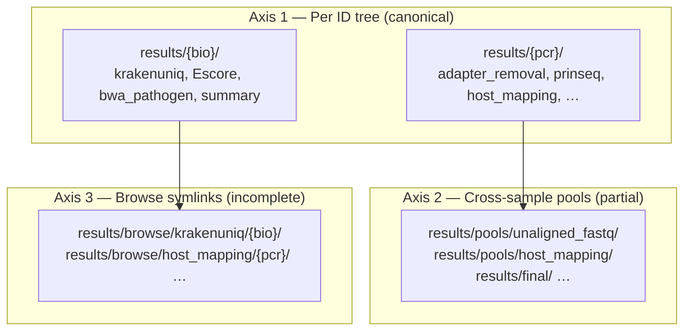

# Output layout audit — sample-centric vs analysis-centric

**Date:** 2026-05-21  
**Question:** Would it be easier if all Kraken files, all E-score files, etc. lived in one directory each?

**Short answer:** Yes for **browsing and hand analysis**; the pipeline should keep **canonical paths** under `results/{sample_id}/` for Snakemake, but you should treat **`results/browse/`** (or a generated catalog) as the human-facing view.

---

## How outputs are organized today (three axes)



| Axis | Pattern | Best for |
|------|---------|----------|
| **Per PCR** | `results/Pig01_LIB1/host_mapping/…` | Library-level QC, host align |
| **Per bio sample** | `results/Pig01/krakenuniq/…` | Metagenomics, pathogen arm |
| **Typed pools** | `results/pools/host_mapping/Pig01.dedup.merged.bam` | Merged BAMs, Kraken input FASTQ |
| **Cohort** | `results/final/*.xlsx`, `results/metagenomics/kraken_abundance/` | Tables, figures |
| **By-type links** | `results/browse/...` | Finding “all Kraken reports” in one folder |

---

## Wildcard confusion (main structural issue)

The same `{sample}` wildcard means **different things**:

| Rule block | `{sample}` is | Example path |
|------------|---------------|--------------|
| `adapter_removal`, `prinseq`, `host_mapping` | PCR ID (`SAMPLES`) | `results/Pig01_LIB1/prinseq/…` |
| `krakenuniq`, `escore`, `bwa_pathogen` | Biological ID (`BIO_SAMPLES`) | `results/Pig01/krakenuniq/…` |

So Kraken is **already** grouped by bio sample under `results/{bio}/krakenuniq/`, but host BAMs for that animal sit under **each PCR folder**, not under `results/Pig01/host_mapping/`.

That split is intentional (PCR-level libraries vs bio-level classification), but it is why the tree “feels scattered.”

---

## What is already in one place

| Analysis | “All files together” location today | Complete? |
|----------|--------------------------------------|-----------|
| KrakenUniq reports | `results/{bio}/krakenuniq/` + optional `results/browse/krakenuniq/{bio}/` | Symlink rule exists; **not** in `rule all` |
| E-value pathogen | `results/{bio}/evalue/pathogen/` + `results/browse/evalue/pathogen/` | In `rule all` |
| Cohort Excel | `results/final/` | Yes |
| Kraken abundance matrix | `results/metagenomics/kraken_abundance/` | Yes |
| Merged unaligned FASTQ | `results/pools/unaligned_fastq/` | Yes |
| Merged host BAMs | `results/pools/host_mapping/` | Yes |
| Pathogen BAMs (per bio) | `results/{bio}/pathogen_mapping/` (many files per pathogen) | Per-sample tree only |
| Adapter removal / prinseq | `results/{pcr}/adapter_removal/`, `results/{pcr}/prinseq/` | Per PCR only |

---

## Pain points

1. **Two folder names for one animal** — `results/Pig01/` (Kraken) vs `results/Pig01_LIB1/`, `Pig01_LIB2/` (host).
2. **`results/browse/` is incomplete** — only ~9 `_by_type` rules; Kraken symlinks are not requested by default `rule all`.
3. **OneDrive / symlink races** — some `_by_type` targets were disabled in `rule all` (e.g. fastq_screen).
4. **Scripts hard-code paths** — ~50+ references to `results/{sample}/...` in `scripts/`; moving canonical paths = **v2 breaking change**.
5. **Mixed pools** — `sample_*` directories vs nested `results/{id}/` vs `final/` — three mental models.

---

## Recommended strategy (do not rewrite all paths yet)

### Keep canonical (Snakemake)

```
results/{pcr_or_bio}/<step>/...
results/sample_<artifact>/
results/final/
```

Snakemake rules, checkpoints, and `scripts/pigsti_paths.py` stay on these paths.

### Improve browse (humans)

**Option A — Finish `results/browse/` (low risk)**  
One end-of-pipeline step symlinks known artefacts into:

```
results/browse/
  krakenuniq/{bio}/
  krakenuniq_output/{bio}/
  Escore/genus|species|pathogen/{bio}/
  adapter_removal/{pcr}/
  prinseq/{pcr}/
  fastq_screen/{pcr}/
  host_mapping/{pcr}/
  mtdna_mapping/{pcr}/
  unaligned_fastq/{pcr}/
  sample_unaligned_fastq/{bio}/
  pathogen_mapping/{bio}/          # many symlinks per pathogen
  summary/{bio}/
  comparison/{bio}/          # if HOPS
```

Enable via `build_results_catalog: true` → rule runs `scripts/build_results_catalog.py` (see below).

**Option B — Analysis-first canonical tree (high risk, v2)**  

```
results/analysis/krakenuniq/{bio}/...
results/analysis/escore/{bio}/...
results/libraries/{pcr}/host/...
```

Requires Snakefile + every script + published paths to migrate. Only worth it for a major release.

**Option C — Catalog only (minimal)**  
`results/final/output_catalog.tsv` — columns `analysis`, `level`, `sample_id`, `path` — no symlinks. Safest on Windows/OneDrive.

---

## Proposed unified browse layout (Option A)

| Folder under `results/browse/` | Contents | Sample key |
|--------------------------------|----------|------------|
| `krakenuniq/` | `*_kraken-report.txt`, `*_output.txt` | bio |
| `Escore/pathogen/` | `*_pathogen.csv` | bio |
| `adapter_removal/` | `*.collapsed.gz` | PCR |
| `prinseq/` | `*-passed.fq.gz` | PCR |
| `unaligned_fastq/` | PCR unaligned FASTQ | PCR |
| `sample_unaligned_fastq/` | merged (+ prinseq-passed) | bio |
| `host_mapping/` | dedup BAMs | PCR |
| `pathogen_mapping/` | dedup BAMs | bio |
| `final/` | symlinks to `results/final/*.xlsx` | cohort |

PCR vs bio subfolders use **sample ID as filename prefix** so sorting in Explorer/Finder stays obvious.

---

## Implementation status

| Item | Status |
|------|--------|
| `scripts/build_results_catalog.py` | Added — TSV + optional symlinks |
| Config `build_results_catalog` | In `config.example.yaml` (default `true`) |
| Snakefile rule `build_results_catalog` | Wired when flag on |
| Canonical path change | **Not done** (by design) |

---

## Quick reference — where to look

| I want… | Look here |
|---------|-----------|
| All Kraken reports | `results/browse/krakenuniq/` (after catalog run) or `results/*/krakenuniq/` |
| All E-value pathogen CSVs | `results/browse/evalue/pathogen/` |
| All final tables | `results/final/` |
| One PCR’s host BAM | `results/{pcr_id}/host_mapping/` |
| One animal’s pathogen QC | `results/{bio_id}/pathogen_mapping/` |
| Full path list | `results/final/output_catalog.tsv` |

---

## Related docs

- [`OUTPUT_SCHEMA.md`](OUTPUT_SCHEMA.md) — canonical naming
- [`CHECKPOINT_PATHOGEN_MAPPING.md`](CHECKPOINT_PATHOGEN_MAPPING.md)
- [`TESTING_CHECKLIST.md`](TESTING_CHECKLIST.md)
