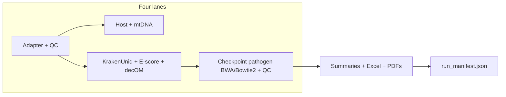

# PIGSTI overall audit (consolidated)

**Date:** 2026-05-21  
**Scope:** Full pipeline review across `PIGSTI/` (active dev tree) and `PIGSTI_publication/` (release candidate).  
**Prior passes:** [`SNAKEMAKE_AUDIT_REPORT.md`](SNAKEMAKE_AUDIT_REPORT.md), [`SNAKEMAKE_AUDIT_PASS2.md`](SNAKEMAKE_AUDIT_PASS2.md), [`OUTPUTS_AND_SUMMARIES_AUDIT.md`](OUTPUTS_AND_SUMMARIES_AUDIT.md)

---

## Executive summary

| Tree | Publication readiness | Notes |
|------|----------------------|--------|
| **`PIGSTI_publication/`** | **B+ → A-** | Pre-flight validation, summary-chain fixes, HOPS-off defaults aligned with typical configs, orphan rules removed |
| **`PIGSTI/`** (IDE default) | **C+** | Still carries pass-1/2 bugs fixed only in publication copy; **do not tag Zenodo from here without sync** |

PIGSTI is **scientifically complete** for aDNA pathogen screening: KrakenUniq → E-score → checkpointed mapping → rich QC → cohort Excel/PDFs + reproducibility manifest. Remaining work is **engineering hygiene** (monolithic Snakefile, doc drift, two-tree divergence), not missing core biology.

---

## Two-tree drift (critical)

Several fixes exist **only** under `PIGSTI_publication/`. If you run or cite from `PIGSTI/`, these still apply:

| Item | `PIGSTI/` | `PIGSTI_publication/` |
|------|-----------|------------------------|
| `enable_hops` code default | `True` | `False` (matches your `config.yaml`) |
| `validate_pigsti_setup` rule | Missing | Present → `results/workflow/.pigsti_validation_ok` |
| Orphan `select_best_pathogens` + `get_bwa_targets()` | Present | Removed |
| `summarize_pathogen_data_pcr` | Broken (`{sample}`+`{pcr}` wildcards) | Fixed (`PCR_INFO`) |
| `refs_for_sample()` | `replace(" ", "_")` only | `safe_name()` |
| Entropy DAG deps (100/1000 bp) | Missing | In summarize inputs |
| `merge_summaries` Excel sheet | Implicit `Sheet1` | `pathogen_summary` |
| `scripts/pigsti_naming.py` | Missing | Present |
| `decom_run` failure policy | `\|\| true` (silent fail) | `decom_fail_on_error` (default strict) |
| `summarize_host_mtdna` threads | `999` | `summary_threads` (default 8) |
| `config/config.example.yaml` | Missing | Present |
| Pass-3 summary audit doc | Link only in `PIPELINE_AUDIT.md` | Full [`OUTPUTS_AND_SUMMARIES_AUDIT.md`](OUTPUTS_AND_SUMMARIES_AUDIT.md) |

**Recommendation:** Treat **`PIGSTI_publication/`** as the release branch, or run a one-way merge into `PIGSTI/` before any paper/GitHub release.

---

## Architecture snapshot

| Metric | Value |
|--------|--------|
| Snakefile lines | ~3780 (`PIGSTI`), ~3840 (`publication`, +validation) |
| Named rules | ~80 each |
| Config toggles | 15+ (`pathogen_mapping_mode`, aligners, HOPS, decOM, screening-only, …) |
| Wildcard namespaces | PCR (`SAMPLES`) vs biological (`BIO_SAMPLES`) |

---

## Grades by area

| Area | Grade | Comment |
|------|-------|---------|
| Scientific coverage | **A** | ANI, breadth, entropy (100/1000 bp), edit-distance decay, damage split, HOPS optional |
| DAG correctness (publication) | **A-** | Checkpoint barriers, memoized parsing, entropy inputs wired |
| DAG correctness (`PIGSTI/`) | **B-** | PCR summarize + `refs_for_sample` gaps |
| Reproducibility | **B+** | `run_manifest.json`, conda per rule; env pins still loose; BAM bytes may vary by CPU |
| Naming consistency | **B+** (pub) / **C+** (main) | `safe_name` in Snakefile; scripts partially unified via `pigsti_naming` in publication only |
| Documentation | **C+** | README Diamond not implemented; `bwa_*` dirs when Bowtie2 used |
| Operability | **B** | ENA helpers, cleanup, strict_inputs; monolithic Snakefile hurts onboarding |
| Publication packaging | **B+** (pub tree) | Example config, audit docs, workflow figure |

---

## Strengths (unchanged — keep)

1. **Checkpoint-driven pathogen mapping** — only E-score/HOPS hits get BAMs (not full spreadsheet Cartesian product).
2. **`pathogen_mapping_complete.txt` barrier** — summaries wait for qualimap/damage/entropy/edit-distance before CSV merge.
3. **Per-rule conda environments** — practical reproducibility on HPC.
4. **`results/run_manifest.json`** — hashes of Snakefile, configs, env YAMLs + git commit.
5. **Dual layout** — `results/` + `results/browse/` symlinks for browsing.
6. **Screening-only mode** — pathogen arm without host BAM requirement.
7. **Pipeline report + diagram** — in `rule all` without requiring HOPS (both trees).

---

## Open issues (both trees unless noted)

### High

| ID | Issue | Trees | Fix |
|----|-------|-------|-----|
| H1 | **Two-tree divergence** | workspace | Merge publication → `PIGSTI/` or archive only publication |
| H2 | **Monolithic Snakefile** + **duplicate `config.yaml` load** (~line 2539/2570) | both | Modular `workflow/rules/*.smk`; single CFG load |
| H3 | **README Diamond** (`enable_diamond`) — no Snakemake rules | both | Remove docs or implement optional rules |
| H4 | **Committed `config.yaml` with `/raid_md0/...` paths** | both | Ship `config.example.yaml`; gitignore local config (`PIGSTI/` lacks example) |

### Medium

| ID | Issue | Trees | Fix |
|----|-------|-------|-----|
| M1 | **Dual scoring** when HOPS on (CSV `Score` vs `pathogen_detection/*`) | both | Methods paragraph (template in pass-3 audit) |
| M2 | `summarize_inputs()` dead helper | both | Delete |
| M3 | Legacy `host_mapping` / `bwa_pathogen` dir names with Bowtie2 | both | Document in README/OUTPUT_SCHEMA (already noted) |
| M4 | Conda envs without strict pins | both | Pin major versions for Zenodo |
| M5 | `Damage_3p_GtoA` in criteria but not summary CSV | both | Export column or drop from criteria display |

### Low

| ID | Issue | Trees | Fix |
|----|-------|-------|-----|
| L1 | FastQ Screen HTML `|| true` on failure | both | Optional strict mode |
| L2 | `generate_sample_report.R` implicit Excel sheet | both | `sheet_name="pathogen_summary"` |
| L3 | Working copies (`PIGSTI_working_version_*`) stale | workspace | Exclude from release ZIP |

---

## Config vs code defaults (your `PIGSTI/config/config.yaml`)

| Key | Config file | Snakefile default (`PIGSTI/`) | Snakefile default (publication) |
|-----|-------------|-------------------------------|----------------------------------|
| `enable_hops` | `false` | `True` if key omitted | `False` if key omitted |
| `pathogen_mapping_mode` | `default` | `super_careful` | `super_careful` |
| `pathogen_aligner` | `bowtie2` | `bwa` | `bwa` |
| `host_aligner` | `bowtie2` | `bwa` | `bwa` |

**Authoritative:** `config.yaml` wins at runtime; code defaults only matter for missing keys.

---

## `rule all` sanity (publication tree, HOPS off)

With `enable_hops: false` (your config), `rule all` still requests:

- `pathogen_summary_all_samples.xlsx` + **heatmap from Excel `Score`** (`create_pathogen_heatmap`)
- `comprehensive_summary_all_samples.xlsx`
- `pathogen_mapping_complete.txt`, per-sample PDFs, `run_manifest.json`
- Pipeline HTML + workflow PNG/SVG
- **Does not** require HOPS TSV or `pathogen_detection/*` matrix

This is correct for HOPS-off production runs.

---

## Pre-release checklist

1. [ ] Run from **`PIGSTI_publication/`** (or sync fixes into `PIGSTI/`)
2. [ ] `snakemake -n` / dry-run on target `rule all` with your real `config.yaml`
3. [ ] Confirm `results/workflow/.pigsti_validation_ok` created (publication only today)
4. [ ] Archive git commit + `run_manifest.json` + `config.yaml` + `samples.tsv` + `Pathogen_spreadsheet.csv`
5. [ ] Regenerate [`docs/images/pipeline_workflow.png`](images/pipeline_workflow.png)
6. [ ] Methods: cite **`pathogen_summary` sheet** `Score` column; clarify HOPS matrix if used
7. [ ] Zenodo ZIP excludes `PIGSTI_working_version_*` and machine-specific paths

---

## Pathogen checkpoint fix (2026-05-21)

`--rerun-incomplete` could run `generate_pathogen_targets` on a **subset** of samples because `get_sample_ref_pairs()` used `os.path.exists()`. Fix: `metagenomics_screening_cohort_ready` gate + `build_pathogen_target_pairs.py` with `--strict-cohort`. See [`CHECKPOINT_PATHOGEN_MAPPING.md`](CHECKPOINT_PATHOGEN_MAPPING.md).

## Suggested next actions (ordered)

1. **Merge `PIGSTI_publication` → `PIGSTI`** (or declare publication folder canonical) — checkpoint fix is now in **both** trees.
2. Remove **orphan rules** from `PIGSTI/` (`select_best_pathogens`, `get_bwa_targets`).
3. Add **`config/config.example.yaml`** to `PIGSTI/`.
4. Strip or implement **Diamond** in README.
5. Optional: modular Snakefile + remove mid-file config reload.

---

## Related documents

| Doc | Focus |
|-----|--------|
| [`PIPELINE_AUDIT.md`](PIPELINE_AUDIT.md) | Original publication-readiness roadmap |
| [`OUTPUT_SCHEMA.md`](OUTPUT_SCHEMA.md) | Path conventions |
| [`OUTPUTS_AND_SUMMARIES_AUDIT.md`](OUTPUTS_AND_SUMMARIES_AUDIT.md) | Excel/CSV chain |
| [`SNAKEMAKE_AUDIT_PASS2.md`](SNAKEMAKE_AUDIT_PASS2.md) | Scripts + naming |
| [`../PUBLICATION_README.md`](../PUBLICATION_README.md) | Release-tree changelog |
